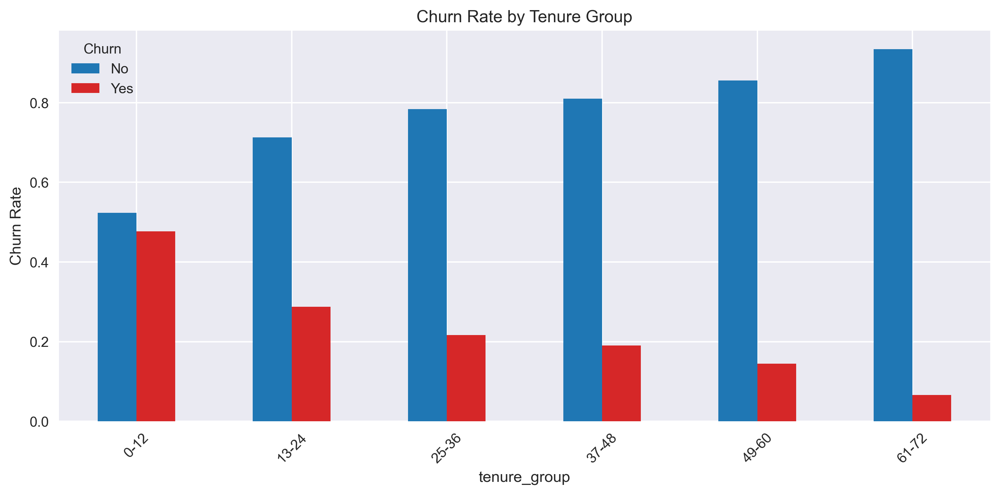
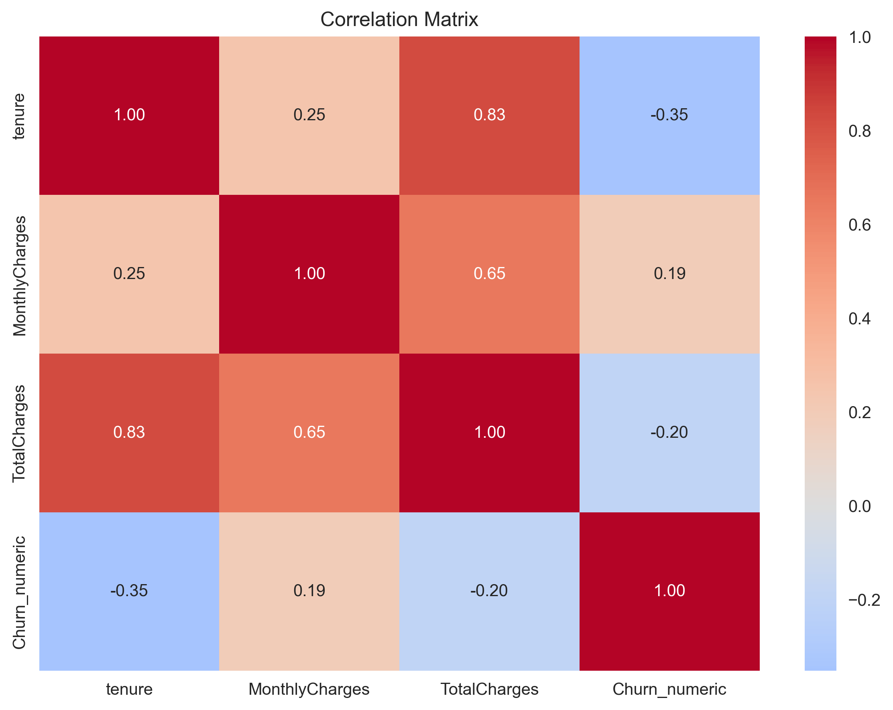
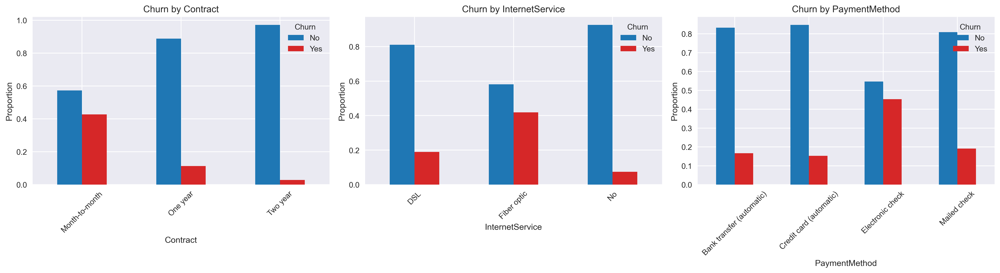
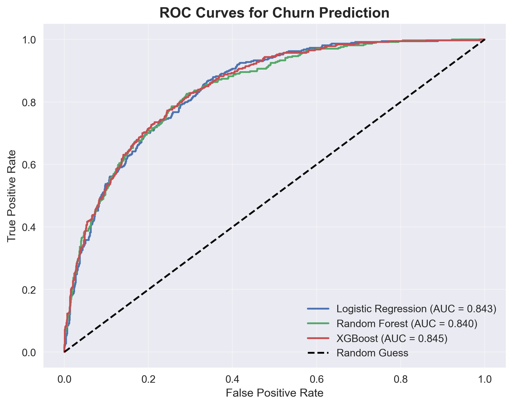
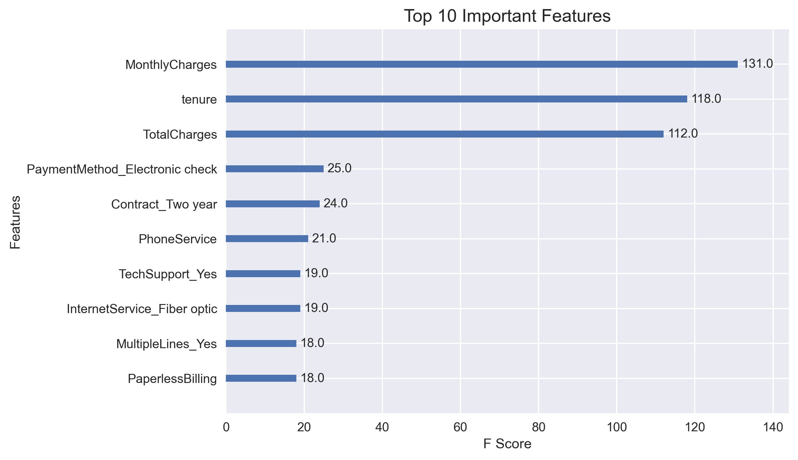

# 📊 Telco Customer Churn Prediction
*A data-driven project focused on understanding and predicting customer churn in the telecom industry.*

This project explores customer churn in the telecom industry using real-world data. As a data analyst, I used Python and machine learning to understand why customers leave and how businesses can reduce churn using data-driven decisions.
## Executive Summary
🔍 **Overview**: Analyzed a dataset of 7,043 Telco customers to identify churn drivers and build predictive models. Churn rate: 26.54%. Used EDA, feature engineering, and models like XGBoost (AUC: 0.845) to provide actionable recommendations.

**Key Wins**: Identified high-risk customer groups, such as month-to-month contract users, enabling targeted retention strategies.
## Business Problem
💼 **Challenge**: Telco companies lose revenue from customer churn. Why do customers leave? How can we predict and prevent it?

**Goal**: Use historical customer data to identify churn drivers and predict which customers are most likely to leave, so the business can act early.
## Methodology
🛠️ **Step-by-Step Approach**:
1. **Data Loading & Cleaning**: Loaded CSV, handled missing values in TotalCharges, dropped duplicates/customerID.
2. ### Exploratory Data Analysis (EDA)

**Churn by Tenure(Months)**

**Numerical Features**

**Correlation Matrix**

**Categorical Drivers**

3. **Feature Engineering**: Created `tenure_group`, `total_services`; encoded categoricals; scaled numerics.
4. **Modeling**: Trained Logistic Regression, Random Forest, XGBoost with GridSearchCV. Evaluated with F1, AUC-ROC, confusion matrices.
   - ROC Curves: 
   - Confusion Matrices: 
   - Feature Importance: 
5. **Interpretation**: Derived insights from top features (e.g., Contract type).

**Tools Used**: Python (Pandas, Scikit-learn, XGBoost), Jupyter/Notebook for interactivity.

## Key Skills & Tools
- **Data Cleaning & EDA**: Handling nulls, visualizations for insights.
- **Feature Engineering**: Binning, encoding, scaling.
- **Machine Learning**: Model training, tuning, evaluation (AUC, F1, ROC).
- **Business Acumen**: Translated data to recommendations (e.g., incentives for fiber optic users).
- **Tools**: Python, GitHub, Markdown for portfolios.

## Results and Business Recommendations
🏆 **Results**:
- Best Model: XGBoost (AUC: 0.845, F1 for Churn: 0.58).
- Top Features: Contract type, Internet Service, Payment Method.

  
**Recommendations** 🔥:
- Offer discounts to month-to-month customers to encourage longer contracts.
- Target fiber optic users with loyalty perks (they churn more).
- Promote auto-payments over electronic checks to reduce churn.
- Engage new customers early (first-year churn is high).

**EDA Summary** (from eda_summary.txt): Churn Rate: 26.54%. Key drivers: Short tenure, etc.

## How to Run This Project
1. Clone repo: `git clone https://github.com/najeebullahii/telco-customer-churn-analysis.git`
2. Install dependencies: `pip install -r requirements.txt` (create this file with your libs: pandas, seaborn, etc.)
3. Run: `python churn_analysis.py`

## License
MIT License—feel free to fork and improve!
